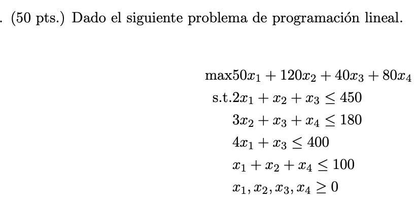

## Tarea 1

Dado el siguiente problema de programaci´on lineal.



Responder:

a. Resuelva el problema anterior utilizando Ampl.

[Ver solución](solution.mod)

b. ¿Cuál es el valor óptimo de la función objetivo?

> ```
> z = 11840
> ```

c. ¿Cuál es el valor de las variables de decisión?

> ```
> x1 = 64
> x2 = 0
> x3 = 144
> x4 = 36
> ```

d. Suponga que las variables `s1`, `s2`, `s3` y `s4` representan las variables de holgura de las restricciones `1`, `2`, `3` y `4`, respectivamente. ¿Cuál es el valor de las variables de holgura?

[Ver solución](solution-d.mod)

> ```
> s1 = 178
> s2 = 0
> s3 = 0
> s4 = 0
> ```