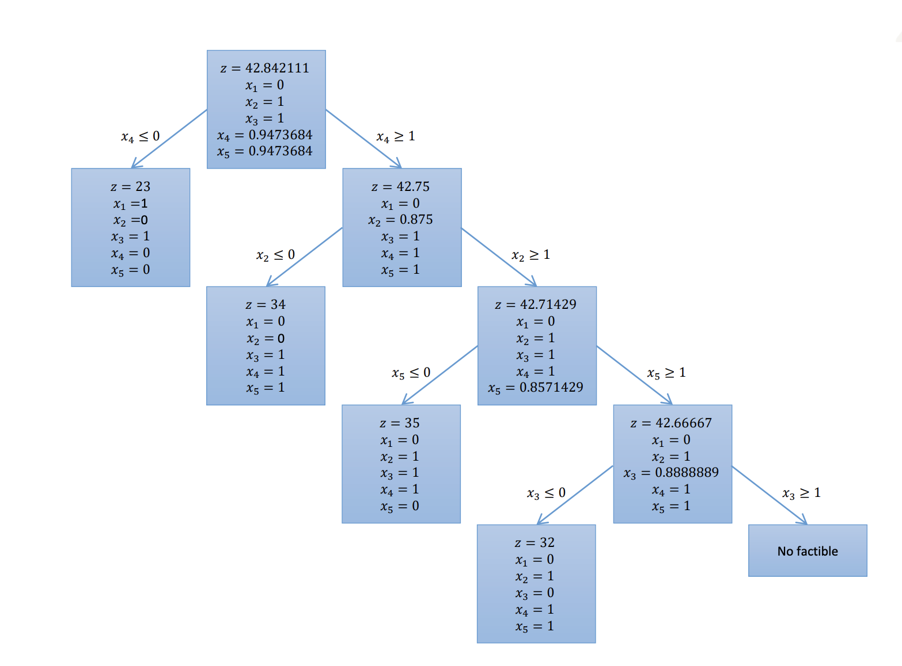
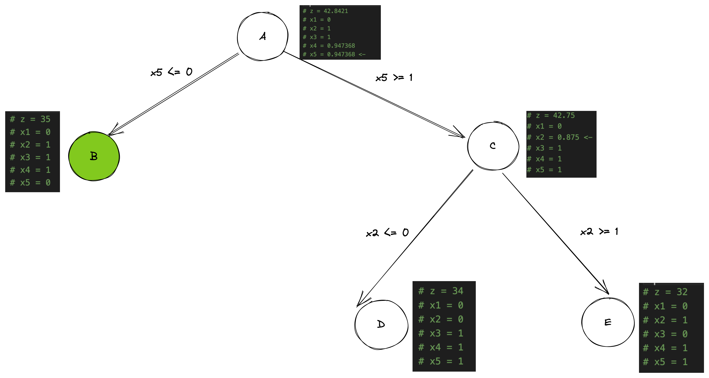

# Inciso 2 

Resultado esperado calculado por [proff.mod](proof.mod)
```
z = 35
x1 = 0
x2 = 1
x3 = 1
x4 = 1
x5 = 0
```

> Compare resultados de utilizar diferentes variables. `x5` por `x4`

Comparado con el ejercicio hecho en clases, la elección de x5 hizo más corto el procedimiento. 

Visto en clases


Árbol obtenido eligiendo `x5`
